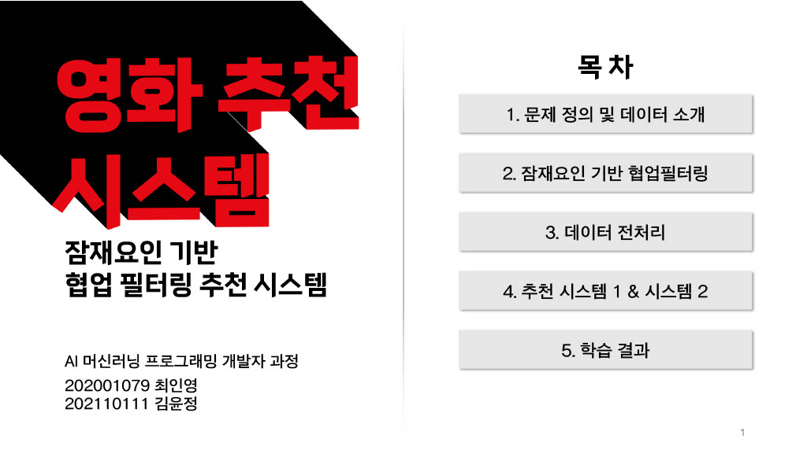
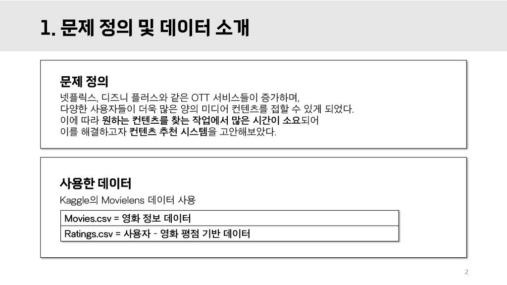
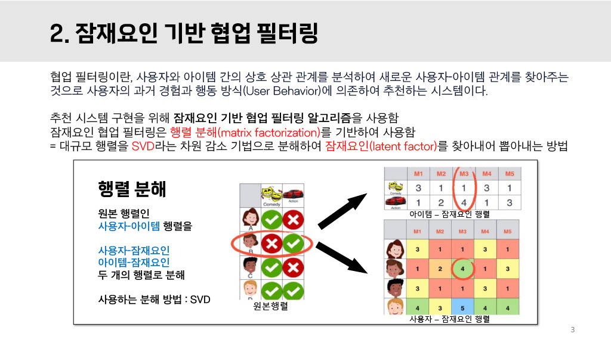
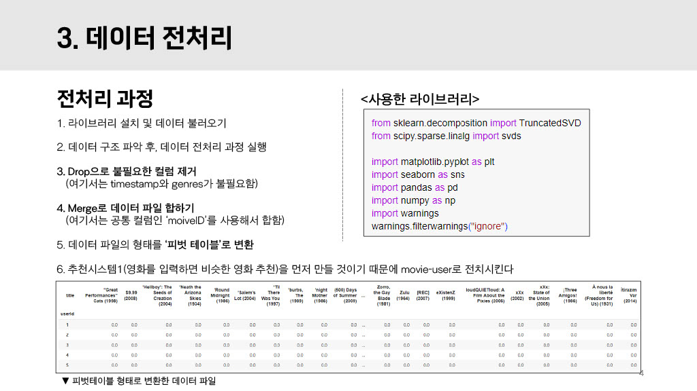
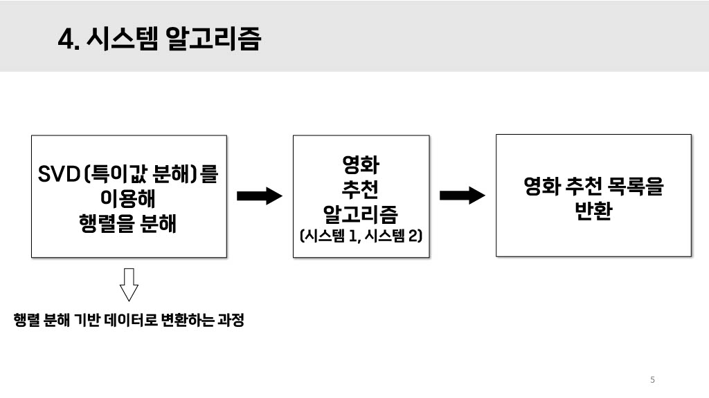
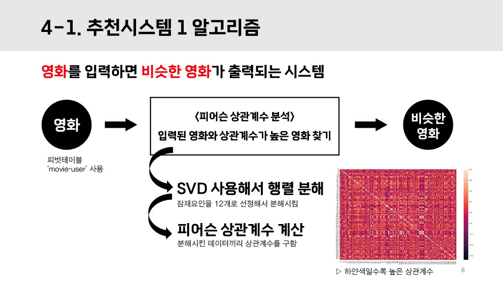
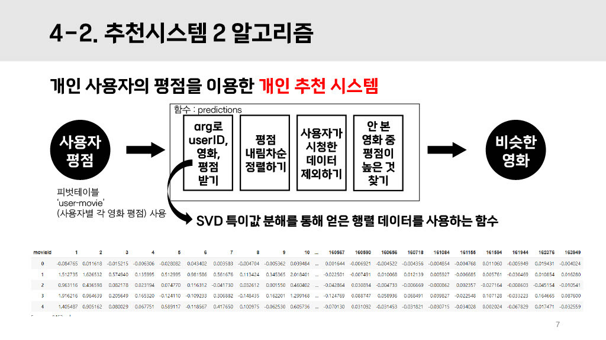
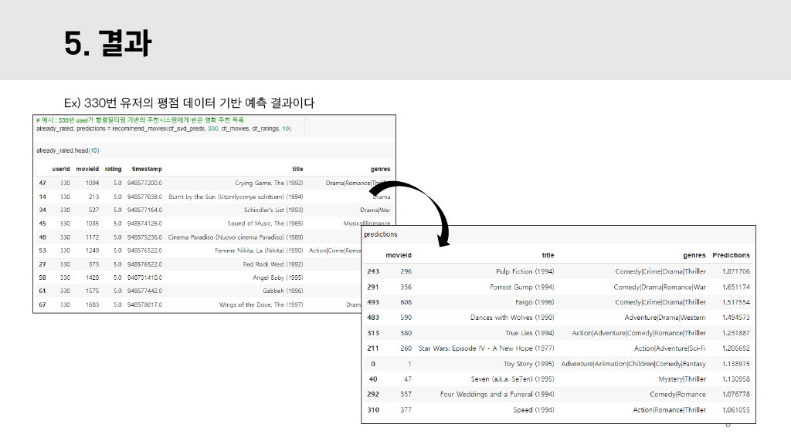

# 잠재요인 기반 협업 필터링을 활용한 영화 추천 알고리즘 :movie_camera:
**DATE : 2023년 04월**  
 
AI 공부를 처음 시작할 당시, 알고리즘 구현 과제로 '**잠재요인 기반 협업 필터링**'을 선택하였다.  
팀 프로젝트였지만, 같은 알고리즘을 각자 공부하여 가르쳐주는 스터디 방식으로 진행하였다.   
잠재요인 기반 협업 필터링은 **특이값 분해라고 불리는 'SVD'를 사용하여 잠재요인을 뽑아낸다**.  
알고리즘에 대한 자세한 설명은 밑의 자료에서 보충한다.   

